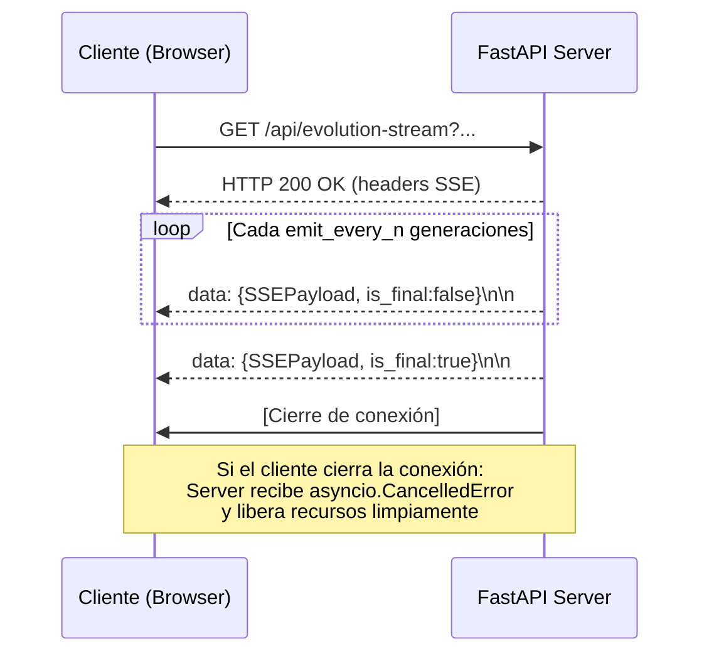

# Contrato SSE: `/api/evolution-stream`

**Feature**: 003-genetic-engine-sse-livedit
**Tipo**: Server-Sent Events (SSE)
**Versión**: 1.0

---

## Descripción

Endpoint de streaming que emite el estado de evolución del Algoritmo Genético generación a generación. El cliente establece una conexión HTTP de larga duración y recibe eventos mientras el motor calcula la optimización.

---

## Endpoint

```
GET /api/evolution-stream
```

**Base URL**: `NEXT_PUBLIC_GENETIC_ENGINE_URL` (variable de entorno)

---

## Query Parameters

| Parámetro | Tipo | Requerido | Por Defecto | Descripción |
|---|---|---|---|---|
| `water_total_liters` | `float` | ✅ Sí | — | Total de agua disponible (litros/día) |
| `energy_total_kwh` | `float` | ✅ Sí | — | Total de energía disponible (kWh/día) |
| `num_inhabitants` | `int` | ✅ Sí | — | Número de habitantes |
| `cultivable_area_m2` | `float` | ✅ Sí | — | Superficie de cultivo activa (m²) |
| `w_human` | `float` | No | `0.40` | Peso objetivo supervivencia humana (0.0–1.0) |
| `w_crop` | `float` | No | `0.35` | Peso objetivo viabilidad de cultivos (0.0–1.0) |
| `w_balance` | `float` | No | `0.25` | Peso objetivo balance energético (0.0–1.0) |
| `emit_every_n` | `int` | No | `5` | Emitir evento cada N generaciones |

**Nota**: Si `w_human + w_crop + w_balance ≠ 1.0`, el servidor normaliza automáticamente y lo indica en el primer evento con `weights_normalized: true`.

---

## Response Headers

```
Content-Type: text/event-stream
Cache-Control: no-cache
Connection: keep-alive
X-Accel-Buffering: no
```

---

## Formato de Eventos SSE

El protocolo SSE usa el campo `data:` con un JSON stringificado por evento. Cada evento termina con doble newline (`\n\n`).

```
data: {JSON_PAYLOAD}\n\n
```

---

## Esquema del Payload JSON

```typescript
interface SSEPayload {
  generation:          number;    // Número de generación actual (0-indexed)
  avg_fitness:         number;    // Fitness promedio de la población [0.0, 1.0]
  max_fitness:         number;    // Fitness del mejor individuo [0.0, 1.0]
  top3:                ParetoScenario[]; // Siempre 3 elementos
  is_final:            boolean;   // true únicamente en el último evento
  viable_count:        number;    // Individuos con fitness > 0 en esta generación
  weights_normalized?: boolean;   // true solo en el primer evento si los pesos fueron normalizados
}

interface ParetoScenario {
  scenario_id:               "human_priority" | "crop_viability" | "balanced" | "unavailable";
  label:                     string;   // Texto legible en español
  water_liters_per_day:      number;   // Total agua asignada (litros/día)
  energy_kwh_per_day:        number;   // Total energía asignada (kWh/día)
  water_human_liters:        number;   // Desglose: agua para consumo humano
  water_irrigation_liters:   number;   // Desglose: agua para riego
  energy_habitat_kwh:        number;   // Desglose: energía para habitabilidad
  energy_agro_kwh:           number;   // Desglose: energía agrícola
  fitness_score:             number;   // Fitness ponderado [0.0, 1.0]
  pareto_rank:               number;   // 1 = no dominado (frente de Pareto)
}
```

---

## Ejemplos de Payload

### Evento intermedio (generación 5)
```
data: {"generation":5,"avg_fitness":0.31,"max_fitness":0.72,"top3":[{"scenario_id":"human_priority","label":"Prioridad Humana","water_liters_per_day":680.0,"energy_kwh_per_day":32.0,"water_human_liters":520.0,"water_irrigation_liters":160.0,"energy_habitat_kwh":22.0,"energy_agro_kwh":10.0,"fitness_score":0.72,"pareto_rank":1},{"scenario_id":"crop_viability","label":"Viabilidad de Cultivos","water_liters_per_day":450.0,"energy_kwh_per_day":45.0,"water_human_liters":250.0,"water_irrigation_liters":200.0,"energy_habitat_kwh":15.0,"energy_agro_kwh":30.0,"fitness_score":0.65,"pareto_rank":1},{"scenario_id":"balanced","label":"Supervivencia Equilibrada","water_liters_per_day":565.0,"energy_kwh_per_day":38.0,"water_human_liters":385.0,"water_irrigation_liters":180.0,"energy_habitat_kwh":20.0,"energy_agro_kwh":18.0,"fitness_score":0.68,"pareto_rank":1}],"is_final":false,"viable_count":54}

```

### Evento final (generación 199)
```
data: {"generation":199,"avg_fitness":0.78,"max_fitness":0.94,"top3":[...],"is_final":true,"viable_count":87}

```

### Evento con normalización de pesos (primer evento)
```
data: {"generation":0,"avg_fitness":0.12,"max_fitness":0.61,"top3":[...],"is_final":false,"viable_count":38,"weights_normalized":true}

```

### Evento con Frente de Pareto degenerado (recursos insuficientes)
```
data: {"generation":0,"avg_fitness":0.0,"max_fitness":0.0,"top3":[{"scenario_id":"unavailable","label":"No disponible","water_liters_per_day":0.0,"energy_kwh_per_day":0.0,"water_human_liters":0.0,"water_irrigation_liters":0.0,"energy_habitat_kwh":0.0,"energy_agro_kwh":0.0,"fitness_score":0.0,"pareto_rank":0},{"scenario_id":"unavailable",...},{"scenario_id":"unavailable",...}],"is_final":false,"viable_count":0}

```

---

## Ciclo de Vida de la Conexión



---

## Comportamiento de Errores

| Situación | Comportamiento del Servidor | Comportamiento del Cliente |
|---|---|---|
| Parámetros requeridos faltantes | HTTP 422 Unprocessable Entity (antes de abrir el stream) | Mostrar error de configuración |
| Todos los individuos inviables (fitness=0) | Continúa emitiendo eventos con `viable_count: 0` y `top3` de `"unavailable"` | Mostrar advertencia de recursos críticos |
| Error interno durante la evolución | Emite un evento de error y cierra la conexión: `data: {"error": "Internal error during evolution", "generation": N}` | Mostrar error y ofrecer reintentar |
| Cliente desconectado | Detecta `asyncio.CancelledError`, limpia recursos, termina silenciosamente | N/A |
| Timeout de red | El cliente `EventSource` recibe `onerror`; reintenta hasta 3 veces automáticamente | Mostrar estado "Reconectando..." |

---

## Restricciones de Concurrencia

- El endpoint soporta mínimo **10 conexiones SSE simultáneas** sin degradación (SC-005).
- Cada conexión SSE crea una instancia de `GeneticAlgorithm` independiente — no hay estado compartido entre sesiones.
- El servidor no limita el número de conexiones concurrentes por diseño; el límite es la capacidad del servidor de despliegue.

---

## Ejemplo de Integración en el Cliente

```typescript
// src/lib/geneticEngineClient.ts
const BASE_URL = process.env.NEXT_PUBLIC_GENETIC_ENGINE_URL;

export function buildEvolutionStreamUrl(
  waterTotal: number,
  energyTotal: number,
  inhabitants: number,
  area: number,
  weights: { w_human: number; w_crop: number; w_balance: number }
): string {
  const params = new URLSearchParams({
    water_total_liters: waterTotal.toString(),
    energy_total_kwh:   energyTotal.toString(),
    num_inhabitants:    inhabitants.toString(),
    cultivable_area_m2: area.toString(),
    w_human:            weights.w_human.toString(),
    w_crop:             weights.w_crop.toString(),
    w_balance:          weights.w_balance.toString(),
  });
  return `${BASE_URL}/api/evolution-stream?${params.toString()}`;
}
```
