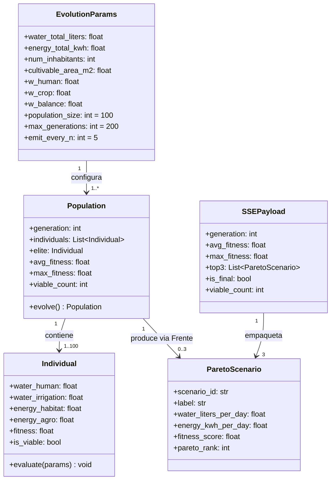

# Data Model: Motor Genético Real con Transparencia SSE

**Feature**: 003-genetic-engine-sse-livedit
**Phase**: 1 (Design)
**Date**: 2026-09-20

---

## Entidades del Motor Genético (Backend Python)

### `Individual` — Cromosoma de la Población

Representa una propuesta de distribución de recursos. Es la unidad de trabajo del algoritmo genético.

| Campo | Tipo | Descripción | Restricciones |
|---|---|---|---|
| `water_human` | `float` | Litros/día asignados a consumo humano directo | ≥ 0.0 |
| `water_irrigation` | `float` | Litros/día asignados a riego de cultivos | ≥ 0.0 |
| `energy_habitat` | `float` | kWh/día para habitabilidad (calefacción, iluminación) | ≥ 0.0 |
| `energy_agro` | `float` | kWh/día para producción agrícola (luces, bombas) | ≥ 0.0 |
| `fitness` | `float` | Valor de fitness calculado. `0.0` si inviable | [0.0, 1.0] |
| `is_viable` | `bool` | True si no supera ningún recurso total disponible | Derivado |

**Regla de viabilidad** (validación de restricción dura):
```
is_viable = (
  (water_human + water_irrigation) <= params.water_total_liters
  AND
  (energy_habitat + energy_agro) <= params.energy_total_kwh
)
if not is_viable → fitness = 0.0  [irrevocable, sin excepciones]
```

**Relaciones**: Pertenece a una `Population`. Puede ser seleccionado como `ParetoScenario`.

---

### `Population` — Estado de una Generación

Snapshot de todos los individuos en un ciclo evolutivo.

| Campo | Tipo | Descripción |
|---|---|---|
| `generation` | `int` | Número de generación (0-indexado) |
| `individuals` | `List[Individual]` | Lista de todos los individuos (tamaño = `population_size`) |
| `elite` | `Individual` | El individuo con mayor fitness de esta generación |
| `avg_fitness` | `float` | Promedio de fitness de todos los individuos (incluye los fitness=0) |
| `max_fitness` | `float` | Fitness del individuo élite |
| `viable_count` | `int` | Número de individuos con fitness > 0 |

**Transiciones de estado**:
```
Population(gen=N) → [selección + cruce + mutación] → Population(gen=N+1)
  con élite(gen=N) preservado automáticamente en Population(gen=N+1)
```

---

### `EvolutionParams` — Parámetros de Entrada de una Sesión

Define el problema de optimización completo. Recibido como query params en el endpoint SSE.

| Campo | Tipo | Por Defecto | Descripción |
|---|---|---|---|
| `water_total_liters` | `float` | — | Total de agua disponible por día (litros) |
| `energy_total_kwh` | `float` | — | Total de energía disponible por día (kWh) |
| `num_inhabitants` | `int` | — | Número de habitantes de la colonia |
| `cultivable_area_m2` | `float` | — | Superficie de invernadero activa (m²) |
| `w_human` | `float` | `0.40` | Peso del objetivo supervivencia humana |
| `w_crop` | `float` | `0.35` | Peso del objetivo viabilidad de cultivos |
| `w_balance` | `float` | `0.25` | Peso del objetivo balance energético |
| `population_size` | `int` | `100` | Número de individuos por generación |
| `max_generations` | `int` | `200` | Criterio de parada: generaciones máximas |
| `emit_every_n` | `int` | `5` | Frecuencia de emisión de eventos SSE |

**Regla de normalización de pesos**:
```
if (w_human + w_crop + w_balance) != 1.0:
  total = w_human + w_crop + w_balance
  w_human /= total; w_crop /= total; w_balance /= total
  # Se notifica en el primer evento SSE con campo "weights_normalized: true"
```

---

### `ParetoScenario` — Arquetipo de Decisión

Individuo seleccionado del Frente de Pareto que representa una estrategia de asignación.

| Campo | Tipo | Descripción |
|---|---|---|
| `scenario_id` | `Literal` | `"human_priority"`, `"crop_viability"`, `"balanced"`, o `"unavailable"` |
| `label` | `str` | Nombre legible del escenario para mostrar en UI |
| `water_liters_per_day` | `float` | Total de agua asignada (water_human + water_irrigation) |
| `energy_kwh_per_day` | `float` | Total de energía asignada (energy_habitat + energy_agro) |
| `water_human_liters` | `float` | Desglose: agua para consumo humano |
| `water_irrigation_liters` | `float` | Desglose: agua para riego |
| `energy_habitat_kwh` | `float` | Desglose: energía para habitabilidad |
| `energy_agro_kwh` | `float` | Desglose: energía agrícola |
| `fitness_score` | `float` | Fitness ponderado del individuo seleccionado |
| `pareto_rank` | `int` | Rango de Pareto del individuo (1 = no dominado) |

**Reglas de selección de arquetipos desde el Frente**:
- `human_priority`: `argmax(f_human)` sobre todos los individuos del Frente rank-1
- `crop_viability`: `argmax(f_crop)` sobre todos los individuos del Frente rank-1
- `balanced`: `argmin(euclidean_distance(f_human, f_crop), utopian_point=(1.0, 1.0))` sobre el Frente rank-1

---

### `SSEPayload` — Mensaje del Stream

Payload JSON emitido en cada evento SSE.

| Campo | Tipo | Descripción |
|---|---|---|
| `generation` | `int` | Generación actual emitida |
| `avg_fitness` | `float` | Fitness promedio de la generación |
| `max_fitness` | `float` | Fitness máximo de la generación |
| `top3` | `List[ParetoScenario]` | Los 3 arquetipos del Frente de Pareto actual. Siempre 3 elementos (puede incluir `scenario_id: "unavailable"`) |
| `is_final` | `bool` | `true` solo en el último evento (generación `max_generations - 1`) |
| `weights_normalized` | `bool` | `true` solo en el primer evento si los pesos fueron normalizados |
| `viable_count` | `int` | Número de individuos viables en la generación actual |

---

### `OptimizationSession` — Registro de Sesión (en memoria, store.ts)

Registro de una sesión de optimización completada, para historial del tablero.

| Campo | Tipo | Descripción |
|---|---|---|
| `session_id` | `string` | UUID generado en el cliente al iniciar la conexión SSE |
| `started_at` | `string` | ISO 8601 timestamp |
| `params_snapshot` | `EvolutionParams` | Snapshot de los parámetros usados |
| `final_top3` | `ParetoScenario[]` | Top-3 del resultado final |
| `selected_scenario_id` | `string \| null` | Escenario aprobado por la asamblea (null si no votado) |
| `status` | `"running" \| "completed" \| "cancelled"` | Estado de la sesión |

---

## Entidades del Frontend (TypeScript)

### `EvolutionEvent` — Evento SSE parseado

Equivalente TypeScript del `SSEPayload`.

```typescript
interface EvolutionEvent {
  generation: number;
  avg_fitness: number;
  max_fitness: number;
  top3: ParetoScenario[];
  is_final: boolean;
  weights_normalized?: boolean;
  viable_count: number;
}
```

### `ParetoScenario` — Escenario de Pareto en Frontend

```typescript
interface ParetoScenario {
  scenario_id: 'human_priority' | 'crop_viability' | 'balanced' | 'unavailable';
  label: string;
  water_liters_per_day: number;
  energy_kwh_per_day: number;
  water_human_liters: number;
  water_irrigation_liters: number;
  energy_habitat_kwh: number;
  energy_agro_kwh: number;
  fitness_score: number;
  pareto_rank: number;
}
```

### `OptimizationWeights` — Pesos del Frontend

```typescript
interface OptimizationWeights {
  w_human: number;   // 0.0 – 1.0 (normalizado automáticamente)
  w_crop: number;
  w_balance: number;
}
```

### `ConvergenceDataPoint` — Punto de datos de la gráfica

```typescript
interface ConvergenceDataPoint {
  generation: number;
  avg_fitness: number;
  max_fitness: number;
}
```

---

## Diagrama de Relaciones (Backend)



---

## Validaciones Críticas del Modelo

| Validación | Regla | Dónde se aplica |
|---|---|---|
| Restricción dura de recursos | `sum(water) ≤ water_total` AND `sum(energy) ≤ energy_total` | `fitness.py` → `evaluate()` |
| Fitness irrevocable = 0 | Ningún operador genético puede "reparar" un individuo inviable; solo puede producir nuevos individuos en generaciones futuras | `fitness.py`, `genetic_algorithm.py` |
| Normalización de pesos | `w_human + w_crop + w_balance = 1.0` antes de calcular fitness | `schemas.py` (validador Pydantic) |
| Top-3 sin duplicados | Los tres arquetipos deben ser individuos distintos; si el Frente tiene < 3 soluciones, el sobrante es `"unavailable"` | `pareto.py` |
| Valores no negativos | Todos los campos de asignación de recursos son ≥ 0.0 | `schemas.py` (ge=0 en Pydantic) |
