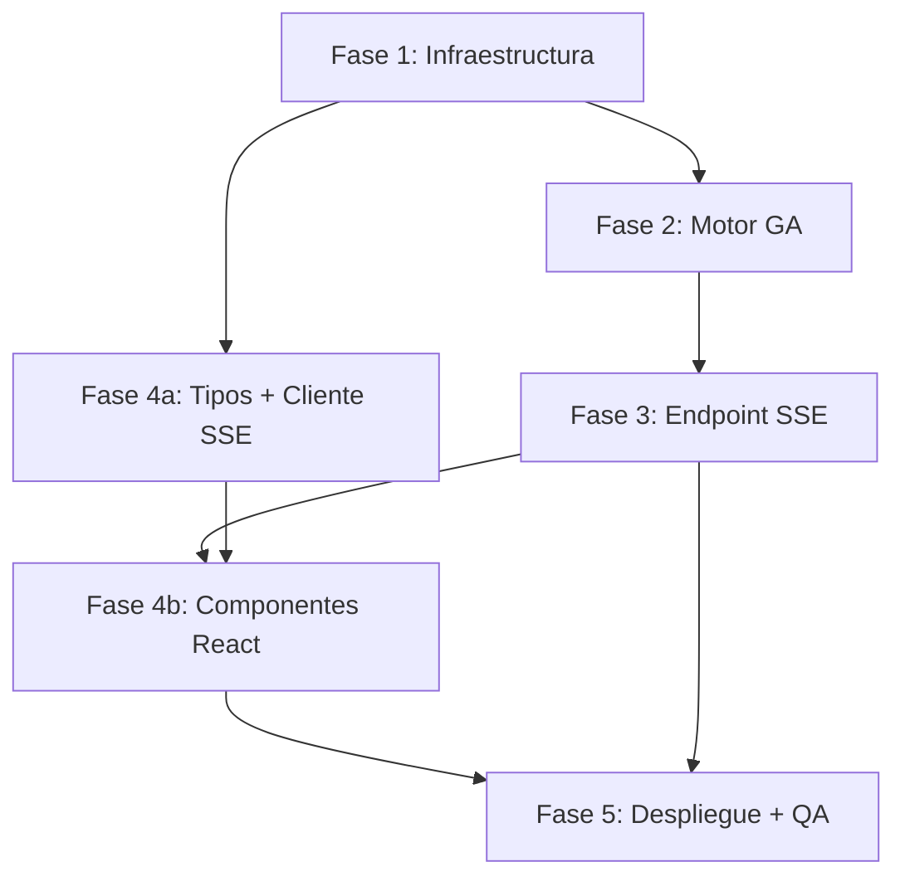

# Implementation Plan: Motor Genético Real con Transparencia SSE y Edición en Vivo

**Branch**: `003-genetic-engine-sse-livedit` | **Date**: 2026-09-20 | **Spec**: [spec.md](./spec.md)

**Input**: Feature specification from `specs/003-genetic-engine-sse-livedit/spec.md`

---

## Summary

Reemplazar el motor determinista hardcodeado en `src/lib/mathEngine.ts` por un **microservicio Python (FastAPI)** que ejecuta un Algoritmo Genético real. El microservicio expone un endpoint SSE (`/api/evolution-stream`) que emite el estado de la población generación a generación, calcula el Frente de Pareto y entrega exactamente tres arquetipos de escenario. El frontend Next.js consume este stream mediante `EventSource`, anima gráficos de convergencia en tiempo real y permite que la asamblea reajuste pesos con controles deslizantes, disparando reconexiones SSE imperceptibles (< 600 ms).

---

## Technical Context

**Language/Version (Backend)**: Python 3.11+ · FastAPI 0.111+

**Language/Version (Frontend)**: TypeScript 5 · Next.js 14.2 (App Router) · React 18

**Primary Dependencies**:
- Backend: `fastapi`, `uvicorn[standard]`, `sse-starlette`, `numpy`, `pydantic`
- Frontend: `recharts` (nuevo), `lucide-react` (existente), Tailwind CSS (existente)

**Storage**: Sin nueva base de datos. El historial de decisiones (escenario votado, parámetros, timestamp) se persiste en el `store.ts` en memoria existente, con extensión a un endpoint `/api/vote` ya presente.

**Testing**:
- Backend: `pytest` + `httpx` (cliente async para SSE)
- Frontend: Jest + React Testing Library (ya configurado)

**Target Platform**: Backend → Railway / Render (servicio web persistente, no serverless). Frontend → Vercel (sin cambios).

**Performance Goals**:
- 200 generaciones · 100 individuos → < 10 s (SC-004)
- Latencia de primer evento SSE → < 500 ms (SC-001)
- Reconexión tras slider change → < 600 ms total (SC-002)

**Constraints**:
- Penalización fitness = 0 irrevocable para individuos inviables (FR-003, constitución Principio 2)
- Sin LLM en el loop de cálculo matemático (constitución Principio 2)
- CORS configurado para permitir consumo desde dominio Vercel del frontend
- Vercel Serverless Functions NO son viables para SSE de larga duración → microservicio separado obligatorio

**Scale/Scope**: Hasta 10 conexiones SSE simultáneas (SC-005) · 1 microservicio Python · 4 nuevos componentes React · extensión de 3 rutas API existentes

---

## Constitution Check

*GATE: Must pass before Phase 0 research. Re-check after Phase 1 design.*

| Principio Constitucional | Estado | Evidencia |
|---|---|---|
| **P1 – Soberanía de la Asamblea**: La IA no aplica escenarios unilateralmente | ✅ PASS | El motor calcula; el endpoint `/api/vote` existente requiere acción explícita del usuario para aplicar un escenario. |
| **P2 – Cálculo Determinista Obligatorio**: Sin LLM en el loop matemático | ✅ PASS | El AG puro Python (numpy) calcula fitness y Pareto. El LLM (openRouter) sigue usándose solo para explicación textual post-cálculo, no para decidir asignaciones. |
| **P3 – Transparencia y Anti-Acaparamiento**: Información pública y clara | ✅ PASS | El stream SSE expone generación a generación el estado de la población. El Top-3 es visible continuamente. |
| **P4 – Infraestructura Ágil y Despliegue Continuo**: GitHub + Vercel | ✅ PASS | Frontend continúa en Vercel. El microservicio Python se despliega en Railway/Render con CI/CD desde el mismo repositorio (monorepo, carpeta `/motor_genetico`). |
| **P5 – Arquitectura Orientada a APIs**: Modular y documentada con Postman | ✅ PASS | El microservicio FastAPI genera documentación OpenAPI automática (`/docs`). Se añadirá colección Postman en `/postman/`. |

**Resultado Gate**: ✅ Todos los principios satisfechos. Autorizado para continuar.

---

## Project Structure

### Documentation (this feature)

```text
specs/003-genetic-engine-sse-livedit/
├── plan.md              ← este archivo
├── research.md          ← Phase 0 output
├── data-model.md        ← Phase 1 output
├── quickstart.md        ← Phase 1 output
├── contracts/
│   ├── sse-stream.md    ← Contrato del endpoint SSE
│   └── rest-api.md      ← Contrato REST complementario
└── tasks.md             ← Phase 2 output (via /speckit-tasks)
```

### Source Code (repository root)

```text
# Monorepo — Frontend Next.js existente + nuevo microservicio Python
/
├── motor_genetico/                    ← [NEW] Microservicio Python
│   ├── main.py                        ← FastAPI app, lifespan, CORS
│   ├── requirements.txt               ← Dependencias Python fijadas
│   ├── Procfile                       ← Entrada para Railway/Render
│   ├── .env.example                   ← Variables de entorno documentadas
│   ├── core/
│   │   ├── genetic_algorithm.py       ← GA: población, selección, cruce, mutación
│   │   ├── fitness.py                 ← Función fitness multivariable + penalización
│   │   ├── pareto.py                  ← Cálculo del Frente de Pareto + 3 arquetipos
│   │   └── schemas.py                 ← Pydantic models (EvolutionParams, SSEPayload)
│   ├── api/
│   │   └── evolution_stream.py        ← Endpoint SSE /api/evolution-stream
│   └── tests/
│       ├── test_fitness.py            ← Unit tests: penalización, cálculo correcto
│       ├── test_pareto.py             ← Unit tests: frente de Pareto, arquetipos
│       └── test_sse_stream.py         ← Integration tests: stream SSE end-to-end
│
├── src/                               ← Frontend Next.js (existente, extendido)
│   ├── lib/
│   │   ├── mathEngine.ts              ← [MODIFY] Deprecar calculateScenarios(); mantener INITIAL_STATE
│   │   ├── store.ts                   ← [MODIFY] Añadir estado de sesión de optimización
│   │   └── geneticEngineClient.ts     ← [NEW] Funciones de conexión SSE + helpers
│   ├── types/
│   │   └── index.ts                   ← [MODIFY] Añadir tipos: EvolutionEvent, ParetoScenario, OptimizationWeights
│   ├── components/
│   │   ├── GeneticEngine/             ← [NEW] Componentes del motor genético
│   │   │   ├── ConvergenceChart.tsx   ← Gráfica animada Recharts (fitness avg/max vs generación)
│   │   │   ├── WeightSliders.tsx      ← Controles deslizantes W_humano/W_cultivo/W_balance
│   │   │   └── EvolutionStatus.tsx    ← Indicador de estado (calculando / recalculando / completado)
│   │   └── ScenarioComparator/
│   │       └── ScenarioCard.tsx       ← [MODIFY] Adaptar para recibir ParetoScenario con fitness_score
│   └── app/
│       └── page.tsx                   ← [MODIFY] Integrar GeneticEngine panel + SSE lifecycle
│
└── postman/
    └── kinich-agro-genetic-engine.json ← [NEW] Colección Postman del microservicio
```

---

## Complexity Tracking

> No hay violaciones constitucionales. Se documenta una decisión de complejidad justificada:

| Decisión | Por qué necesaria | Alternativa rechazada |
|---|---|---|
| Microservicio Python separado (no Next.js API Route) | Las API Routes de Next.js/Vercel son Serverless Functions con timeout de 10-30s y sin soporte para streaming de larga duración. El AG puede tomar hasta 10s (SC-004) más el tiempo de stream de 200 generaciones. | Implementar el AG en TypeScript dentro de Next.js: rechazado porque viola el Principio 2 (cálculo determinista en lenguaje apropiado) y complejiza el mantenimiento del núcleo matemático. |
| `sse-starlette` en lugar de `StreamingResponse` raw | Maneja correctamente el `Last-Event-ID`, el formato SSE (`data: ...\n\n`), y la desconexión del cliente sin código boilerplate manual. | `StreamingResponse` raw: requiere gestión manual del protocolo SSE y manejo de desconexiones, propenso a errores de formato. |

---

## Implementation Phases

### Fase 1 — Infraestructura Híbrida

**Objetivo**: Crear el esqueleto del microservicio Python y establecer la comunicación CORS con el frontend Next.js.

**Entregables**:
- Directorio `/motor_genetico/` con `main.py` vacío funcional y `requirements.txt`
- `main.py` con `FastAPI()`, CORS middleware configurado para el dominio de Vercel y localhost:3000
- Endpoint de salud `GET /health` que retorna `{"status": "ok", "version": "1.0.0"}`
- `Procfile` y `.env.example` para despliegue en Railway/Render
- Variable de entorno `NEXT_PUBLIC_GENETIC_ENGINE_URL` documentada en el frontend

**Criterio de aceptación de fase**: El frontend puede hacer `fetch(process.env.NEXT_PUBLIC_GENETIC_ENGINE_URL + '/health')` y recibir 200 OK tanto en desarrollo local como desde Vercel preview.

---

### Fase 2 — Núcleo del Motor Genético (Python)

**Objetivo**: Implementar el algoritmo genético completo con penalización estricta y cálculo del Frente de Pareto.

**Módulos**:

#### `core/schemas.py` — Contratos de datos
```
EvolutionParams:
  water_total_liters: float        # total disponible
  energy_total_kwh: float          # total disponible
  num_inhabitants: int
  cultivable_area_m2: float
  w_human: float                   # peso objetivo humano
  w_crop: float                    # peso objetivo cultivos
  w_balance: float                 # peso objetivo balance
  population_size: int = 100
  max_generations: int = 200
  emit_every_n: int = 5            # frecuencia de emisión SSE

Individual:
  water_human: float               # litros/día para consumo humano
  water_irrigation: float          # litros/día para riego
  energy_habitat: float            # kWh/día para habitabilidad
  energy_agro: float               # kWh/día para producción agrícola
  fitness: float                   # calculado, 0.0 si inviable

SSEPayload:
  generation: int
  avg_fitness: float
  max_fitness: float
  top3: List[ParetoScenario]
  is_final: bool

ParetoScenario:
  scenario_id: "human_priority" | "crop_viability" | "balanced"
  label: str
  water_liters_per_day: float
  energy_kwh_per_day: float
  fitness_score: float
  pareto_rank: int
```

#### `core/fitness.py` — Función de fitness multivariable
- **Restricción dura**: `if (ind.water_human + ind.water_irrigation) > params.water_total_liters OR (ind.energy_habitat + ind.energy_agro) > params.energy_total_kwh → fitness = 0.0` (irrevocable)
- **Objetivos ponderados** (solo si individuo es viable):
  - `f_human`: tasa de cobertura de necesidad hídrica mínima per cápita (50 L/día/hab)
  - `f_crop`: tasa de cobertura de riego mínimo por m² (3 L/día/m²) × eficiencia energética agrícola
  - `f_balance`: penalización por desbalance energético (deficit/surplus relativo)
  - `fitness = w_human * f_human + w_crop * f_crop + w_balance * (1 - f_balance_penalty)`

#### `core/genetic_algorithm.py` — Motor evolutivo
- **Inicialización**: población aleatoria uniforme dentro de `[0, total_resource]` para cada variable; algunos individuos inviables son esperados y penalizados
- **Selección**: Torneo binario (k=2); favorece individuos con fitness > 0
- **Cruce (Crossover)**: Aritmético — `child = α * parent1 + (1-α) * parent2` con α ~ Uniform(0,1); garantiza que el hijo no supere recursos si ambos padres son viables (se aplica clip posterior)
- **Mutación**: Perturbación gaussiana con σ = 5% del total de cada recurso; clip al rango válido; re-evalúa viabilidad post-mutación
- **Elitismo**: el mejor individuo de cada generación pasa automáticamente a la siguiente (élite size = 1)

#### `core/pareto.py` — Frente de Pareto y arquetipos
- **Algoritmo**: fast non-dominated sort (O(n²) suficiente para n=100)
- **Extracción de arquetipos**:
  1. `human_priority`: individuo del Frente con mayor `f_human`
  2. `crop_viability`: individuo del Frente con mayor `f_crop`
  3. `balanced`: individuo con menor distancia euclidiana al punto utópico `(f_human=1, f_crop=1)`
- Si el Frente produce menos de 3 soluciones no dominadas, los arquetipos faltantes se marcan como `null` con `scenario_id: "unavailable"`

**Criterio de aceptación de fase**: Tests unitarios (`pytest`) pasan:
- `test_fitness.py`: 100% de individuos inviables reciben fitness=0
- `test_pareto.py`: el Frente de Pareto extrae correctamente los 3 arquetipos en datasets conocidos
- Benchmark: 200 gen × 100 ind termina en < 10 s en hardware estándar

---

### Fase 3 — Capa de Streaming SSE

**Objetivo**: Exponer el endpoint SSE que transmite el estado evolutivo en tiempo real.

#### `api/evolution_stream.py`

```
GET /api/evolution-stream
Query params:
  water_total_liters: float (required)
  energy_total_kwh: float (required)
  num_inhabitants: int (required)
  cultivable_area_m2: float (required)
  w_human: float (default: 0.4)
  w_crop: float (default: 0.35)
  w_balance: float (default: 0.25)
  emit_every_n: int (default: 5)

Response:
  Content-Type: text/event-stream
  Cache-Control: no-cache
  X-Accel-Buffering: no
  Connection: keep-alive
```

**Flujo del generador async**:
```
async def evolution_generator(params):
  ga = GeneticAlgorithm(params)
  ga.initialize_population()
  for generation in range(params.max_generations):
    ga.evolve_one_generation()
    if generation % params.emit_every_n == 0 or generation == params.max_generations - 1:
      pareto_front = compute_pareto(ga.population)
      top3 = extract_archetypes(pareto_front)
      payload = SSEPayload(
        generation=generation,
        avg_fitness=ga.avg_fitness(),
        max_fitness=ga.max_fitness(),
        top3=top3,
        is_final=(generation == params.max_generations - 1)
      )
      yield ServerSentEvent(data=payload.model_dump_json())
    await asyncio.sleep(0)  # yield control al event loop
```

**Manejo de desconexiones**:
- `sse-starlette` detecta automáticamente la desconexión del cliente vía `asyncio.CancelledError`
- El generador async es cancelado limpiamente; no se dejan goroutines huérfanas

**CORS**: Configurado para `origins=["https://*.vercel.app", "http://localhost:3000"]`

**Criterio de aceptación de fase**: Test de integración con `httpx.AsyncClient` verifica que:
- El stream emite exactamente `ceil(max_generations / emit_every_n)` eventos más 1 final
- El último evento tiene `is_final: true`
- Cerrar el cliente desde el lado del test no produce excepciones no manejadas en el servidor

---

### Fase 4 — Frontend Reactivo y Visualización (Next.js)

**Objetivo**: Integrar el stream SSE en el tablero, animar gráficos de convergencia y habilitar edición de pesos en vivo.

#### Nuevos tipos (`src/types/index.ts`)

```typescript
interface EvolutionEvent {
  generation: number;
  avg_fitness: number;
  max_fitness: number;
  top3: ParetoScenario[];
  is_final: boolean;
}

interface ParetoScenario {
  scenario_id: 'human_priority' | 'crop_viability' | 'balanced' | 'unavailable';
  label: string;
  water_liters_per_day: number;
  energy_kwh_per_day: number;
  fitness_score: number;
  pareto_rank: number;
}

interface OptimizationWeights {
  w_human: number;   // 0.0–1.0
  w_crop: number;
  w_balance: number;
}
```

#### `src/lib/geneticEngineClient.ts`

```typescript
// Construye la URL con todos los params
export function buildEvolutionStreamUrl(
  resourceState: SystemState,
  weights: OptimizationWeights
): string

// Hook React que encapsula la lógica EventSource + debounce
export function useEvolutionStream(
  resourceState: SystemState,
  weights: OptimizationWeights
): {
  events: EvolutionEvent[];
  latestTop3: ParetoScenario[];
  isConnecting: boolean;
  isComplete: boolean;
  error: string | null;
}
```

**Lógica del hook `useEvolutionStream`**:
1. `useRef` guarda la instancia activa de `EventSource`
2. `useCallback` con `useDebounce(250ms)` construye nueva URL y llama a `reconnect()`
3. `reconnect()`:
   - Llama `esRef.current?.close()` si hay conexión activa
   - Limpia el array `events` y setea `isConnecting = true`
   - Crea nuevo `EventSource(url)` y registra `onmessage`, `onerror`
4. `onmessage`: parsea JSON, append a `events`, actualiza `latestTop3`; si `is_final`, setea `isComplete = true`, cierra `EventSource`
5. `onerror`: intenta reconexión automática hasta 3 veces (con backoff de 1s) antes de setear `error`

#### `src/components/GeneticEngine/ConvergenceChart.tsx`

- Usa `recharts` `LineChart` con dos `Line`: `avg_fitness` (azul) y `max_fitness` (verde)
- Eje X: número de generación; eje Y: valor fitness (dominio [0, 1])
- Animación: `isAnimationActive={true}` con `animationDuration={300}`
- `ResponsiveContainer` para adaptabilidad a Tailwind breakpoints

#### `src/components/GeneticEngine/WeightSliders.tsx`

- Tres sliders HTML `input[type=range]` para W_humano, W_cultivo, W_balance
- Cada slider tiene rango [0, 100] (internamente se divide entre 100 para normalizar)
- Al cambiar cualquier slider: dispara el debounce de 250ms del hook
- Indicador de suma total: si suma ≠ 100%, muestra badge naranja "Normalizando automáticamente"
- Los tres valores siempre se normalizan a 1.0 antes de enviar al motor

#### `src/components/GeneticEngine/EvolutionStatus.tsx`

- `isConnecting`: spinner + "Calculando optimización..."
- Entre eventos: "Generación {N} de 200"
- `isComplete`: checkmark verde + "Optimización completada"
- `error`: alerta roja con botón "Reintentar"

#### `src/app/page.tsx` — Integración

El panel del Motor Genético se muestra cuando `systemState.status === 'crisis_paused'`, reemplazando el llamado a `/api/scenarios`. El componente padre pasa `systemState` (agua y energía disponibles) al hook `useEvolutionStream`.

**Criterio de aceptación de fase**:
- Abrir el tablero con crisis activa → gráfica comienza a animarse sin acción adicional del usuario
- Mover un slider → gráfica se reinicia visualmente desde generación 0 en < 600 ms
- Tres tarjetas de escenario se actualizan en cada evento SSE recibido

---

### Fase 5 — Despliegue Híbrido y QA

**Objetivo**: Configurar el despliegue del microservicio y ejecutar pruebas de carga del stream SSE.

#### Despliegue del microservicio Python

**Plataforma recomendada: Railway** (ver research.md)

Configuración mínima:
```
# Procfile
web: uvicorn main:app --host 0.0.0.0 --port $PORT

# Variables de entorno en Railway
CORS_ORIGINS=https://kinich-agro.vercel.app,http://localhost:3000
```

**Variable en Vercel**:
```
NEXT_PUBLIC_GENETIC_ENGINE_URL=https://motor-genetico.railway.app
```

#### Colección Postman (`postman/kinich-agro-genetic-engine.json`)

- `GET /health` — Verificación de disponibilidad del servicio
- `GET /api/evolution-stream` con parámetros de prueba (usando Postman + SSE receiver)
- `GET /docs` — Referencia a documentación OpenAPI autogenerada

#### Pruebas de carga SSE (SC-005)

Herramienta: script Python con `httpx.AsyncClient` + `asyncio.gather` para simular 10 conexiones simultáneas. Métrica: ninguna sesión debe retrasarse más de 1s respecto a la primera en emitir el evento de generación 100.

Script ubicado en: `motor_genetico/tests/test_load_sse.py`

---

## Dependency Map



> La Fase 4a (tipos TypeScript y hook cliente) puede desarrollarse en paralelo con las Fases 2 y 3, usando datos mockeados en el frontend hasta que el endpoint esté disponible.

---

## Risk Register

| Riesgo | Probabilidad | Impacto | Mitigación |
|---|---|---|---|
| AG no converge en 200 generaciones para todos los parámetros | Media | Alto | Aumentar max_generations a 500 en la configuración; emitir `is_final` al agotar generaciones independientemente del fitness alcanzado |
| Vercel SSE timeout (30s límite en Serverless Functions) | Alta (si se usara Vercel para el backend) | Alto | **Mitigado por diseño**: el microservicio va en Railway/Render, no en Vercel |
| Frente de Pareto degenerado (todos con fitness=0) | Baja-Media | Medio | Detectar en `pareto.py` y emitir evento de error con `scenario_id: "unavailable"` para los 3 arquetipos; el frontend muestra advertencia |
| Cold start del microservicio tarda > 30s en el primer request | Media (Render free tier) | Medio | Usar Railway Hobby plan con servicio siempre activo; o implementar endpoint `/health` pinging periódico desde Vercel cron |
| Recharts no disponible en SSR de Next.js 14 App Router | Baja | Medio | `ConvergenceChart.tsx` usa `'use client'` y dynamic import con `ssr: false` si es necesario |
